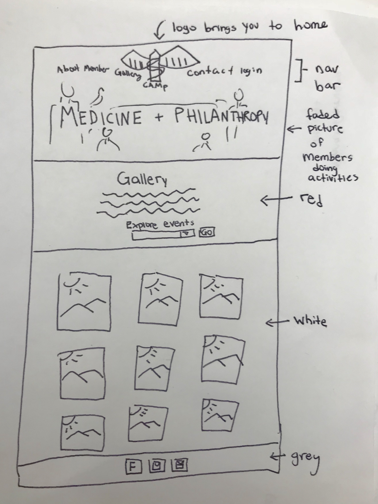

# Project 4 - Design & Plan

Your Team Name: White Moose

## Milestone 1, Part II: Client Selection

### Client Description

[Tell us about your client. Who is your client? What kind of website do they want? What are their key goals?]

[NOTE: If you are redesigning an existing website, give us the current URL and some screenshots of the current site. Tell us how you plan to update the site in a significant way that meets the final project requirements.]

Our client is the leader of an on-campus STEM/Pre-health focused organization, called Cornell Association of Medicine and Philanthropy (CAMP).
They raise awareness and give back through philanthropic events for different causes.
They would like to have a website that displays their team members in a more
visually-appealing way. They are also interested in having an application form
for prospective members. One of the bigger goals that they were interested in
was displaying their photos from different events in a neat way. They would like
people to be able to easily upload/delete photos if they have admin privileges.

They currently do not have a hosted online site.


## Milestone 1, Part III: Client Requirements

### Target Audience(s)

[Tell us about the potential audience for this website. How, when, and where would they interact with the website? Get as much detail as possible from the client to help you find representative users.]

Target audiences include students who are interested in joining the organization. These students should be able to apply with an easy-to-use form, so we will update the current form to make it look nicer and have more functionality. In addition, members of the site are an audience, because they will be updating the images that are displayed. To make things easier for the admins of the site, we will have a login that allows admins to add/delete photos without having to do it themselves in the html code.


### Purpose & Content

[Tell us the purpose of the website and what it is all about.]

Purpose of the website is to entice people to join CAMP and convey CAMP's message to the Cornell community.

### Needs and Wants

[Collect your client's and target audience's needs and wants for the website. Come up with several appropriate design ideas on how those needs may be met. In the **Memo** field, justify your ideas and add any additional comments you have. There is no specific number of needs required for this, but you need enough to do the job.]

* Needs/Wants #1
  * **Needs and Wants** (What does your client and audience need and want?)
    * Clients needs audience to get able to get information about the organization
  * **Design Ideas and Choices** (How will you meet those needs and wants?)
    * Create a clear navigation bar so that the audience knows where to get that information
  * **Memo** (Justify your decisions; additional notes.)

* Needs/Wants #2
  * **Needs and Wants** (What does your client and audience need and want?)
    * Clients needs audience to get able to apply to be a part of the organization
  * **Design Ideas and Choices** (How will you meet those needs and wants?)
    * Create a form that allows users to send an application form to the people in CAMP in charge of membership.
  * **Memo** (Justify your decisions; additional notes.)

### Hosting Plan

[What is your plan for hosting your client's website?]

According to the project guidelines, we will *not* be deploying or hosting the web site for the client.

If they want to deploy the website, we will tell them to use Heroku and to get a paid database service such as AWS.

### Client's Edits

[Does the client need the ability to edit the site after the end of the semester? If **Yes**, tell us how you site fit your client's need. If **No**, write down N/A.]

Yes - the best option is to create a webmaster position on their board (as many clubs have), who will know
how to update and change the website if they need specific changes.

However, the main thing that they need to edit is their image gallery, which we will allow admins to do (by
  adding or deleting photos).  They also need to be able to add new events (aka new tags)

### Information Architecture, Content, and Navigation

[Lay out the plan for how you'll organize the site and which content will go where. Note any content (e.g., text, image) that you need to make/get from the client.]

[Note: As with the Needs and Wants table, there is no specific amount to write here. You simply need enough content to do the job.]

* Content #1
  * **Main Navigation** (List your site's navigation here.)
    * Home
    * About
    * Members
    * Gallery
    * Contact
  * **Sub-Categories** (List any sub-categories of under the main navigation.)
    * Within gallery - different pages for different events
  * **Content** (List all the content corresponding to main navigation and sub-categories.)
    * *Home*: General intro/description of the organization with a few pictures representing the group as a whole
    * *About*: More in-depth explanation of what CAMP is and does
    * *Members*: Descriptions and images of all of the members with the e-board at the top with their titles
    * *Gallery*: Links to pages with pictures from each event
    * *Contact*: A form to email the organization, apply to be a part of it, and links to their social media pages

### Interactivity

[What interactive features will your site have? What PHP elements will you include?]

[Much of this is up to you, however, implementing a login system is **required**. Logging in should not be required to view the site, however it must unlock extra functionality, e.g., admin functionality, comment posting, etc.]

[Also, describe how the interactivity connects with the needs of the clients/target audience.]


Any user can email CAMP or apply to be a member on the Contact page using two different respective forms.
This allows the organization to get new members. People can also give comments to
the organization, and when admins are logged in, they can check these comments
in the contact.php page.


EDIT!!! ADDED MORE INTERACTIVITY TO OUR SITE DURING LATER MILESTONES
We decided to have a timeline serve as our interactivity requirement, because we felt it was very useful to the client.
When the client is logged into the site, the client can go to the about page and add events
to the timeline, and these events and the date that they took place will be displayed to the users.

We also added in login functionality, so admins of the site can add to the gallery and update the

Admins can add and delete photos, and add event tags to images.

### External Code

[What libraries (e.g. editor.js, jQuery Cookie, Image Sliders, jQuery) are you planning to use for the site? What do you have to do to incorporate those libraries? How much of your own code will satisfy the project requirements?]

ORIGINAL!!!
 - jQuery will be used to assist with the gallery
  - In order to be able to use these we will need to include jquery-3.3.1.min.js (from jquery.com/download) which will be placed in the includes folder
  - Once the file is in the includes folder, we need to use php include to include the file on whatever pages we use it in.
  - Our own code will completely satisfy the project requirements, jQuery will be used to simply improve the user experience for our client

EDIT!!! WE DECIDED AGAINST USING JQUERY
We decided to not use JQuery because we realized that it wasn't really necessary, and it
was quite tough for us to learn it in a short period of time. We did, however, use
javascript for the members.php page, where we allowed the user to show and hide text.

### Scale

[How large will the site be (approximate number of pages) and how many hours of work will be required to complete it?]
5 main pages and a potentially "infinite" number of sub pages (which we allow them to build dynamically - images are
  tagged with different events, so we show them any one tag depending on the event they click).

We expect to have roughly 7-10 pages depending
Roughly 20-30 hours?

## Milestone 1, Part IV: Work Distribution

[Describe how each of your responsibilities will be distributed among your group members.]

[Set internal deadlines. Determine your internal dependencies. Whose task needs to be completed first in order for another person's task to be relevant? Be specific in your task descriptions so that everyone knows what needs to be done and can track the progress effectively. Consider how much time will be needed to review and integrate each other's work. Most of all, make sure that tasks are balanced across the team.]

- Justin (Programming Lead)
  - In charge of ensuring that all coding conflicts are resolved and that if such issues arise, that the members with the conflicting code work out the issues.
- Anthony (Client Lead)
  - In charge of being the main point of contact with the client to resolve any discrepancies between project team and client
- Dan (Team Lead)
  - In charge of making sure that the team is on track to complete each milestone before the deadline. He is also in charge of making sure that the team communicates effectively.
- Kamille (Design Lead)
  - In charge of making sure there is a coherent design that is being created. This means that all pages of the website should have the same feel and there shouldn't be any sort of disconnect between pages.

- In addition to the aforementioned roles, all team members are to contribute equally to all tasks. This means that every team member will have some role in the planning, communication with client, and coding of the website that we plan on creating.

## Milestone 1, Part V: Additional Comments

[If you feel like you haven't fully explained your design choices, or if you want to explain some other functions in your site (such as special design decisions that might not meet the final project requirements), you can use this space to justify your design choices or ask other questions about the project and process.]


## Milestone 2, Part I: PHP Interactivity

ORIGINAL!!!
We plan on having a slideshow on the first page of the website (the home page).  Buttons on either side of the main image box will allow users to traverse through a series of pictures about CAMP.

EDIT!!!
We decided against making a slideshow with php because php is more about backend,
and this would not be helpful for a slideshow. Thus, we decided to work on
a timeline on the About page with php because it is more useful and would make more sense
to implement with php.

We decided to have a timeline serve as our interactivity requirement, because we felt it was very useful to the client.
When the client is logged into the site, the client can go to the about page and add events
to the timeline, and these events and the date that they took place will be displayed to the users.


## Milestone 2, Part II: Sketches, Navigation & Wireframes

### Sketches

[Insert your sketches here.]


ORIGINAL!!! ORIGINALLY, WE DID NOT HAVE SKETCHES FOR THE LOGIN/LOGOUT PAGES
index.php sketch


about.php sketch


members.php sketch


contact.php sketch


gallery.php sketch


EDIT!!! WE ADDED SKETCHES FOR THE LOGIN/LOGOUT PAGES

login.php sketch


logout.php sketch


### Navigation

[What will be your top-level pages and your sub-pages for those top-level pages? What will your website's navigational structure?]

[Tip: If you use card sorting for your navigation, show us that work by including a picture!]

Example:
* Home (top-level)
* About
* Members
* Gallery
* Contact
* Login/Logout (Will show login if user is not already logged in. Will show logout if user is already logged in)

Navigational structure will be quite simple. We will have a navigation bar with all of the
top-level page names as tabs. We were thinking of keeping a dropdown menu for the
Gallery tab and having the events in the dropdown, but we realized that we could
simply let the user search by certain events and get images associated with each
event.

### Wireframes

[Insert your wireframes here.]

ORIGINAL!!! ORIGINALLY, WE DID NOT HAVE WIREFRAMES FOR THE LOGIN/LOGOUT PAGES
index.php wireframe


about.php wireframe


members.php wireframe


contact.php wireframe


gallery.php wireframe


header.php wireframe


EDIT!!! WE ADDED WIREFRAMES FOR THE LOGIN/LOGOUT PAGES

login.php sketch


logout.php sketch


## Milestone 2, Part III: Evaluate your Design

[Use the GenderMag method to evaluate your wireframes.]

[Pick a persona that you believe will help you address the gender bias within your design.]

We have selected Tim as our persona.

We selected this persona because he has "high confidence in his abilities with technology." This site is geared towards college students, most of whom understand computers and websites and are willing to navigate unfamiliar websites. His tendency to blame the makers will motivate us to create a bug free, easily navigated site.

### Tasks

[You will need to evaluate at least 3 tasks (known as scenarios in the GenderMag literature). List your tasks here. These tasks are the same as the task you learned in INFO/CS 1300.]

[For each task, list the ideal set of actions that you would like your users to take when working towards the task.]

Task 1: Add a photo to the First Annual Gala sub-page

  1. Login as an administrator in the login page
  2. Go to the manage photos tab
  4. Go to the form to add an image and put in the necessary information
  5. Click submit

Task 2: Apply to be a part of the team

  1. Go to the Contact page
  2. Fill out the application form
  3. Click submit

Task 3: View the pictures from a CAMP event

  1. Click the gallery page
  2. Search the photos to filter by the event's title

### Cognitive Walkthrough

[Perform a cognitive walkthrough using the GenderMag method for all of your Tasks. Use the GenderMag template in the <documents/gendermag-template.md> file.]

#### Task 1 - Cognitive Walkthrough
Task name: Add a photo to the First Annual Gala sub-page

[Add as many subgoals as you needs]

**Subgoal #1: Login**
- Will Tim have formed this sub-goal as a step to their overall goal?
  - No
  - Why? (Especially consider Tim's Motivations/Strategies.)

      [Tell us why..]
      There is no indication on our site that in order to add photos one must be logged in, Tim has high confidence so if he tries to add photos without logging in and fails he will blame the makers of the site.

**Action # 1 : Go to the login page and sign in**
  - Will Tim know what to do at this step?
    - Yes, maybe or no: no
    - Why? (Especially consider Tim's Knowledge/Skills, Motivations/Strategies, Self-Efficacy and Tinkering.)

        Tim may not realize he needs to login in order to add photos so he may bypass this step.

  - If Tim does the right thing, will he know that she did the right thing, and is making progress towards her goal?
    - Yes, maybe or no: yes
    - Why? (Especially consider Tim's Self-Efficacy and Attitude toward Risk.)

        He will see the application form

**Subgoal #2: Go to the manage photos tab**
- Will Tim have formed this sub-goal as a step to their overall goal?
  - Yes
  - Why? (Especially consider Tim's Motivations/Strategies.)

      [Tell us why..]
      Tim is very used to using computers, so he would know to check the manage photos
      tab to add an image. Most sites that allow the user to update information
      would have the option to within user controls.

**Action #2 : Click the button labeled Gallery in the navigation bar**
  - Will Tim know what to do at this step?
    - Yes, maybe or no: yes
    - Why? (Especially consider Tim's Knowledge/Skills, Motivations/Strategies, Self-Efficacy and Tinkering.)

        Tim is experienced with computers so he would know how to find the manage photo
        tab in the navigation bar.

  - If Tim does the right thing, will he know that she did the right thing, and is making progress towards her goal?
    - Yes, maybe or no: yes
    - Why? (Especially consider Tim's Self-Efficacy and Attitude toward Risk.)

        He will see the application form.


**Subgoal #3: Go to the form to add an image and put information in**
- Will Tim have formed this sub-goal as a step to their overall goal?
  - Yes
  - Why? (Especially consider Tim's Motivations/Strategies.)

      [Tell us why..]
      Tim likes exploring, so he would be able to find the form and read that
      he should fill it out in order to add a photo to the gallery.

  **Action #3 : Type responses to questions in the form**
    - Will Tim know what to do at this step?
      - Yes, maybe or no: yes
      - Why? (Especially consider Tim's Knowledge/Skills, Motivations/Strategies, Self-Efficacy and Tinkering.)

          Tim has definitely had experience filling out forms because he loves
          exploring the web.
    - If Tim does the right thing, will she know that she did the right thing, and is making progress towards her goal?
      - Yes, maybe or no: yes
      - Why? (Especially consider Tim's Self-Efficacy and Attitude toward Risk.)

      He knows that the information on the form will be sent to the gallery database

**Subgoal #4: Submit the form**
- Will Tim have formed this sub-goal as a step to their overall goal?
  - Yes, maybe or no: yes
  - Why? (Especially consider Tim's Motivations/Strategies.)

      He will see a submit button and can safely assume that this button is what
      will submit his photo

  **Action #4 : Click submit**

    - Will Tim know what to do at this step?
      - Yes, maybe or no: yes
      - Why? (Especially consider Tim's Knowledge/Skills, Motivations/Strategies, Self-Efficacy and Tinkering.)

          Because Tim knows how to use websites and fill out forms.

    - If Tim does the right thing, will she know that she did the right thing, and is making progress towards her goal?
      - Yes, maybe or no: yes
      - Why? (Especially consider Tim's Self-Efficacy and Attitude toward Risk.)

          He understands that a submit button will do exactly as the name suggests.

#### Task 2 - Cognitive Walkthrough

**Task name: Apply to be a part of the team**

**Subgoal # 1 : Go to the Contact page**

  - Will Tim have formed this sub-goal as a step to their overall goal?
    - Yes, maybe or no: yes
    - Why? (Especially consider Tim's Motivations/Strategies.)

        He should know that in order to apply to be a part of the team, he will
        need to contact the people on the team (thus the Contact page is a good
          place to start looking)

**Action # 1 : Click the button labeled Contact in the navigation bar**
  - Will Tim know what to do at this step?
    - Yes, maybe or no: yes
    - Why? (Especially consider Tim's Knowledge/Skills, Motivations/Strategies, Self-Efficacy and Tinkering.)

        Because Tim knows that to get to the Contact form he needs to click the
        Contact button.  He is experienced with computers.

  - If Tim does the right thing, will she know that she did the right thing, and is making progress towards her goal?
    - Yes, maybe or no: yes
    - Why? (Especially consider Tim's Self-Efficacy and Attitude toward Risk.)

        He will see the application form

**Subgoal # 2 : Fill out the form**

  - Will Tim have formed this sub-goal as a step to their overall goal?
    - Yes, maybe or no: yes
    - Why? (Especially consider Tim's Motivations/Strategies.)

        He will see that the form is titled "Apply" (or something very similar)

**Action # 1 : Type his responses into each text box or select the correct answer**

  - Will Tim know what to do at this step?
    - Yes, maybe or no: yes
    - Why? (Especially consider Tim's Knowledge/Skills, Motivations/Strategies, Self-Efficacy and Tinkering.)

        Because Tim knows how to use websites and fill out forms.

  - If Tim does the right thing, will she know that she did the right thing, and is making progress towards her goal?
    - Yes, maybe or no: yes
    - Why? (Especially consider Tim's Self-Efficacy and Attitude toward Risk.)

        He knows that the information on the form will be sent to the team as
        his application.

**Subgoal # 3 : Submit the form**

  - Will Tim have formed this sub-goal as a step to their overall goal?
    - Yes, maybe or no: yes
    - Why? (Especially consider Tim's Motivations/Strategies.)

        He will see a submit button and can safely assume that this button is what
        will give his application to the club.

**Action # 1 : Click submit**

  - Will [persona name] know what to do at this step?
    - Yes, maybe or no: yes
    - Why? (Especially consider Tim's Knowledge/Skills, Motivations/Strategies, Self-Efficacy and Tinkering.)

        Because Tim knows how to use websites and fill out forms.

  - If [persona name] does the right thing, will she know that she did the right thing, and is making progress towards her goal?
    - Yes, maybe or no: yes
    - Why? (Especially consider Tim's Self-Efficacy and Attitude toward Risk.)

        He understands that a submit button will do exactly as the name suggests.

#### Task 3 - Cognitive Walkthrough

**Task name: View the pictures from a CAMP event**

**Subgoal # 1 : Click the gallery page**

  - Will Tim have formed this sub-goal as a step to their overall goal?
    - Yes, maybe or no: yes
    - Why? (Especially consider Tim's Motivations/Strategies.)

        He should know that in order to see pictures about the website, he
        can click the "Gallery" tab

**Action # 1 : Click the button labeled Gallery in the navigation bar**
  - Will Tim know what to do at this step?
    - Yes, maybe or no: yes
    - Why? (Especially consider Tim's Knowledge/Skills, Motivations/Strategies, Self-Efficacy and Tinkering.)

        Because Tim knows that to get to pictures about CAMP he should start by looking
        at the website's Gallery.

  - If Tim does the right thing, will she know that she did the right thing, and is making progress towards her goal?
    - Yes, maybe or no: yes
    - Why? (Especially consider Tim's Self-Efficacy and Attitude toward Risk.)

        He will see an image gallery (it may not be images from the event
          that he wants, but he will be making progress)

**Subgoal # 2 : Search the photos to filter by the event of his choice**

  - Will Tim have formed this sub-goal as a step to their overall goal?
    - Yes, maybe or no: yes
    - Why? (Especially consider Tim's Motivations/Strategies.)

        He wants to only see images from a particular event, so he knows he
        needs to somehow filter out unwanted images.

**Action # 1 : Select the appropriate event title from the dropdown**

  - Will Tim know what to do at this step?
    - Yes, maybe or no: yes
    - Why? (Especially consider Tim's Knowledge/Skills, Motivations/Strategies, Self-Efficacy and Tinkering.)

        Tim knows the event from which he wants to see images, so he will
        select that event from the list.

  - If Tim does the right thing, will she know that she did the right thing, and is making progress towards her goal?
    - Yes, maybe or no: yes
    - Why? (Especially consider [Tim's Self-Efficacy and Attitude toward Risk.)

        He will see the relevant images in the gallery (and the event title will
          show up, clearly showing that the images are from said event)


### Cognitive Walk-though Results

[Did you discover any issues with your design? What were they? How did you change your design to address the gender-inclusiveness bugs you discovered?]

We discovered that it is not obvious that the user needs to login in order to add photos. Members of the club may attempt to add photos without logging in first.  We would change our design to include a blurb telling the users what logging in allows them to do.

[Your responses here should be very thorough and thoughtful.]

## Milestone 2, Part IV: Database Plan

### Database Schema

[Describe the structure of your database. You may use words or a picture. A bulleted list is probably the simplest way to do this.]

ORIGINAL!!! WE ADDED ONE MORE TABLE, SHOWN UNDER THE EDIT LINE!
Table: accounts
* field 1: id INTEGER, PRIMARY KEY, NOT NULL, UNIQUE, AUTOINCREMENT
* field 2: username TEXT, PRIMARY KEY, NOT NULL, UNIQUE
* field 3: password TEXT, NOT NULL, UNIQUE
* field 4: session TEXT, UNIQUE

Table: photo_gallery
* field 1: id INTEGER, PRIMARY KEY, NOT NULL, UNIQUE, AUTOINCREMENT
* field 2: file_name TEXT, NOT NULL
* field 3: file_ext TEXT, NOT NULL
* field 4: title TEXT, NOT NULL
* field 5: extracurriculars TEXT, NOT NULL

Table: event_photos
* field 1: id INTEGER, PRIMARY KEY, NOT NULL, UNIQUE, AUTOINCREMENT
* field 2: file_name TEXT, NOT NULL
* field 3: file_ext TEXT, NOT NULL
* field 4: caption TEXT, NOT NULL
* field 5: photographer TEXT, NOT NULL
* field 6: citations TEXT, NOT NULL

Table: tags
* field 1: id INTEGER, PRIMARY KEY NOT NULL, UNIQUE, AUTOINCREMENT
* field 2: tag_name TEXT, NOT NULL, UNIQUE

Table: photos_in_tags
* field 1: event_photo_id INTEGER, PRIMARY KEY, NOT NULL, UNIQUE
* field 2: tag_id INTEGER, NOT NULL

Table: comments
* field 1: id INTEGER, PRIMARY KEY, NOT NULL, UNIQUE, AUTOINCREMENT
* field 2: first_name TEXT, NOT NULL
* field 3: last_name TEXT, NOT NULL
* field 4: email TEXT, NOT NULL
* field 5: type TEXT, NOT NULL
* field 6: comment TEXT, NOT NULL

EDIT!!! ADDED ONE MORE TABLE

Table: timeline
* field 1: event_id INTEGER, PRIMARY KEY NOT NULL, UNIQUE, AUTOINCREMENT
* field 2: event_year INTEGER, NOT NULL
* field 3: event_month INTEGER, NOT NULL
* field 4: event_title TEXT, NOT NULL

### Database Queries

[Plan your database queries. You may use natural language, pseudocode, or SQL.]

Login functionality
* Retrieve accounts
  * SELECT * FROM accounts WHERE username = :username
* Update logged in user with the current session
  * UPDATE accounts SET session = :session WHERE id = :id

Logout functionality
* UPDATE accounts SET session = :session WHERE id = :id

Check if user is currently logged in
* SELECT * FROM accounts WHERE session = :session

Retrieve all member photos for members.php
* SELECT * FROM member_photos

Retrieve event photo w/ respective id
* SELECT * FROM event_photos where id = :id

Retrieve tags associated w/ event photos
* SELECT * FROM tags INNER JOIN photos_in_tags
  ON tags.id = photos_in_tags.tag_id
  WHERE photos_in_tags.event_photo_id = :id
* (Where :id was retrieved by the previous query)

Upload event photos (for administrators)
* INSERT INTO event_photos
  (file_name, file_ext, caption, photographer, citations)
  VALUES (:file_name, :file_ext, :caption, :photographer, :citations)

## Milestone 2, Part V: Structure and Pseudocode

### Structure

[List the PHP files you will have. You will probably want to do this with a bulleted list.]

* index.php - main page.
* includes/init.php - stuff that useful for every web page.
* includes/header.php - navigation and header
* includes/footer.php - footer
* about.php - About page with information about the organization.
* members.php - Page with pictures of the members and information about each of them.
* gallery.php - Page with all images. We will allow user to search by event (e.g first annual gala, second annual gala)
* contact.php - Page with application form and contact information
* login.php - Page with login information
* logout.php - Page with logout information

### Pseudocode

[For each PHP file, plan out your pseudocode. You probably want a subheading for each file.]

#### index.php

```
Include init.php
Include header.php

Pseudocode for index.php...

include init.php

foreach image in slideshow images array {
  Put image in slideshow;
}

Include footer.php
```

#### includes/init.php

```
messages = array to store messages for user (you may remove this)

// DB helper functions (you do not need to write this out since they are provided.)

db = connect to db

...

```


#### about.php
```
Include init.php
Include header.php
Include footer.php
```

#### members.php
```
Include init.php
Include header.php
member_photos = SQL Query to select all photos from member_photos table
<h1>Executive Board</h1>
foreach photo in member_photos {
  Display photo
  Display title
  Display extracurriculars
}
Include footer.php
```

#### contact.php
```
Include init.php
Include header.php
Page specific PHP

Header that states that the contact information is displayed
Display contact information
Display page-relevant photos
Form
  First Name field
  Last Name field
  Email field
  Person field
  Comments field
Include footer.php
```

## login.php

```
Include init.php
Include header.php
Form to login
Submit button (calls an init.php function to verify login)
Include footer.php
```

## logout.php

```
Include init.php
Include header.php
logout function
Echo success message
Include footer.php
```

## gallery.php

```
Include init.php
Include header.php
drop down form where the options are all tags (SELECT * FROM tag)
if else statement: if selected show only those tags, else show all images
Include footer.php
```

## Milestone 2, Part VI: Additional Comments

[Add any additional comments you have here.]


## Milestone 3: Updates

[If you make any changes to your plan or design, make a list of the changes here.]
-We decided to not go with a slideshow using php as our php interactivity component, because our graders said it would make more sense with JavaScript. Thus, we thought about it and decided that allowing the user to update a timeline with their own input would be fairly useful and an interesting way to use php interactivity.

-Instead of having a slideshow on the home page, which we thought might look kind of clunky, we went with a cleaner approach and displayed a few images and text in an elegant way.

-Our contact page has a form for the users to give feedback to the admins of the site. We initially didn't plan for this, but we thought it would be useful.

-Our graders said that our description of tags was a bit confusing. We wanted to
keep tags because it would make it easier for users, if for example an image corresponded
to multiple events. However, to make it clearer, we changed the name "tag" to
"Event Name". Users can attach different "Event Names" to each image. Users can
then search by "Event Name" to see all the images associated with a certain event.
Please let us know if you still think this approach is not the best way we should do this.


## Milestone 4: Updates

[If you make any changes to your plan or design based on your peers' feedback, make a list of the changes here.]


## Milestone 5: Cognitive Walkthrough

Task 1: Add a photo to the First Annual Gala sub-page

  1. Login as an administrator in the login page
  2. Go to the gallery tab
  4. Go to the form to add an image and put in the necessary information
  5. Click submit

Task 2: Find out how to be a part of the team

  1. Go to the Contact page
  2. Fill out the form asking how to get involved
  3. Click submit

Task 3: View the pictures from a CAMP event

  1. Click the gallery page
  2. Search the photos to filter by the event's title

For this cognitive walkthrough we have chosen to use Abby

#### Task 1 - Cognitive Walkthrough
Task name: Add a photo to the First Annual Gala sub-page

  **Subgoal #1: Login**
  - Will Abby have formed this sub-goal as a step to their overall goal?
    - Yes
    - Why?

        [Tell us why..]
        Abby does not like learning but tinkering, she tends to stray away from unfamiliar technologies. Pn most common websites in order for a user to add a photo or participate in interactive features of the website they must login. By thinking about the technology she is familiar Abby will know to go to the login page instead of wasting time exploring other pages.

  **Action # 1 : Go to the login page and sign in**
    - Will Abby know what to do at this step?
      - Yes, maybe or no: yes
      - Why? (Especially consider Abby's Knowledge/Skills, Motivations/Strategies, Self-Efficacy and Tinkering.)

          Abby will replicate technology she has used in the past and think about how most common sites require the user to login before uploading content.

    - If Abby does the right thing, will he know that she did the right thing, and is making progress towards her goal?
      - Yes, maybe or no: yes
      - Why? (Especially consider Abby's Self-Efficacy and Attitude toward Risk.)

          Yes, once on the login page she will see that it describes that once logged in a user can upload photos. Abby likes step by step instructions, thus seeing these instructions will restore her confidence, knowing she won't have to tinker to figure out how to upload photos.

  **Subgoal #2: Go to gallery**
  - Will Abby have formed this sub-goal as a step to their overall goal?
    - No
    - Why? (Especially consider Abby's Motivations/Strategies.)

        [Tell us why..]
        While Abby will know to login, she will not know that she needs to go to the gallery tab to actually upload photos, as it was not specifically stated in the instructions on the login page. Abby will become confused at this point and since she does not like tinkering will feel stuck. She has low confidence and will blame herself for not knowing how to proceed.

  **Action #2 : Click the button labeled Gallery in the navigation bar**
    - Will Tim know what to do at this step?
      - Yes, maybe or no: no
      - Why? (Especially consider Tim's Knowledge/Skills, Motivations/Strategies, Self-Efficacy and Tinkering.)

          Abby likes being told what to do step by step. There are no clear instructions on the site saying the gallery tab is where one adds a photo.

    - If Tim does the right thing, will he know that she did the right thing, and is making progress towards her goal?
      - Yes, maybe or no: Yes
      - Why? (Especially consider Abby's Self-Efficacy and Attitude toward Risk.)

          Once on the gallery page, there is clearly a form on the page to upload a photo.


  **Subgoal #3: Go to the form to add an image and put information in**
  - Will Tim have formed this sub-goal as a step to their overall goal?
    - Yes
    - Why? (Especially consider Abby's Motivations/Strategies.)

        [Tell us why..]
        Abby tends to take in all of the information before trying to solve a problem. Once on the gallery page Abby will read the form and see that there are clearly fields indicating to upload a photo.

    **Action #3 : Type responses to questions in the form**
      - Will Tim know what to do at this step?
        - Yes, maybe or no: Yes
        - Why? (Especially consider Tim's Knowledge/Skills, Motivations/Strategies, Self-Efficacy and Tinkering.)

            Since Abby will have already taken in all of the information, she knows that each field is required to upload a photo.

      - If Abby does the right thing, will she know that she did the right thing, and is making progress towards her goal?
        - Yes, maybe or no: Yes
        - Why? (Especially consider [persona name]'s Self-Efficacy and Attitude toward Risk.)

        She will see that all of the fields are filled in and there are no error messages.

  **Subgoal #4: Submit the form**
  - Will Tim have formed this sub-goal as a step to their overall goal?
    - Yes, maybe or no: Yes
    - Why? (Especially consider [persona name]'s Motivations/Strategies.)

        Abby will have seen the submit button when she was taking in all of the information.

    **Action #4 : Click submit**

      - Will [persona name] know what to do at this step?
        - Yes, maybe or no: Yes
        - Why? (Especially consider [persona name]'s Knowledge/Skills, Motivations/Strategies, Self-Efficacy and Tinkering.)

          Abby is familiar with submit buttons from past technologies she has used, she does not like learning new technologies and thus will assume this form works the same way as others she has experienced in the past.

      - If Abby does the right thing, will she know that she did the right thing, and is making progress towards her goal?
        - Yes, maybe or no: Yes
        - Why? (Especially consider Abby's Self-Efficacy and Attitude toward Risk.)

              Once she submits the form she will receive a success message, Abby has low confidence and this message will reassure her that she has done the right thing.

  #### Task 2 - Cognitive Walkthrough

  **Task name: Find out how to be a part of the team**

  **Subgoal # 1 : Go to the Contact page**

    - Will Abby have formed this sub-goal as a step to their overall goal?
      - Yes, maybe or no: Yes
      - Why? (Especially consider Abby's Motivations/Strategies.)

          Abby takes in information before problem solving, thus she will see there is no application tab on the navigation bar and go to the next closet tab, the contact tab.

  **Action # 1 : Click the button labeled Contact in the navigation bar**
    - Will Tim know what to do at this step?
      - Yes, maybe or no: Yes
      - Why? (Especially consider Tim's Knowledge/Skills, Motivations/Strategies, Self-Efficacy and Tinkering.)

          Abby does not like tinkering thus she will do what she is familiar with, and that is licking the tab to get to where she wants.

    - If Tim does the right thing, will she know that she did the right thing, and is making progress towards her goal?
      - Yes, maybe or no: Yes
      - Why? (Especially consider [persona name]'s Self-Efficacy and Attitude toward Risk.)

          She will see a form after taking in all of the information on the page.

  **Subgoal # 2 : Fill out the form and submit**

    - Will Abby have formed this sub-goal as a step to their overall goal?
      - Yes, maybe or no: Yes
      - Why? (Especially consider [persona name]'s Motivations/Strategies.)

          Abby likes step by step instructions when doing something new, she will see on the page it saying if you are interested in joining to fill out the form. This will instruct her to fill out the form.

  **Action # 1 : Type his responses into each text box or select the correct answer and press submit**

    - Will Abby know what to do at this step?
      - Yes, maybe or no: Yes
      - Why? (Especially consider Abby's Knowledge/Skills, Motivations/Strategies, Self-Efficacy and Tinkering.)

          Abby takes in all of the information on the page before solving a problem, thus she will see that there are boxes that satisfy what she is trying to accomplish.

    - If Tim does the right thing, will she know that she did the right thing, and is making progress towards her goal?
      - Yes, maybe or no: Yes
      - Why? (Especially consider Abby's Self-Efficacy and Attitude toward Risk.)

          She will view a success message after submitting, since she has low confidence this messge will help her know she filled out the form properly.

  #### Task 3 - Cognitive Walkthrough

  **Task name: View the pictures from a CAMP event**

  **Subgoal # 1 : Click the gallery page**

    - Will Tim have formed this sub-goal as a step to their overall goal?
      - Yes, maybe or no: Yes
      - Why? (Especially consider [persona name]'s Motivations/Strategies.)

          She will know from past experiences that galleries contain pictures.

  **Action # 1 : Click the button labeled Gallery in the navigation bar**
    - Will Tim know what to do at this step?
      - Yes, maybe or no: Yes
      - Why? (Especially consider Tim's Knowledge/Skills, Motivations/Strategies, Self-Efficacy and Tinkering.)

          Abby does not like tinkering, so since she has viewed pictures on other sites in galleries in the past she will know to click on the gallery tab.

    - If Abby does the right thing, will she know that she did the right thing, and is making progress towards her goal?
      - Yes, maybe or no: Yes
      - Why? (Especially consider Tim's Self-Efficacy and Attitude toward Risk.)

          She will see pictures on the page.

  **Subgoal # 2 : Search the photos to filter by the event of his choice**

    - Will Abby have formed this sub-goal as a step to their overall goal?
      - Yes, maybe or no: Yes
      - Why? (Especially consider Tim's Motivations/Strategies.)

        Since abby takes in information before problem solving she will see on the page that their is a search by event option.

  **Action # 1 : Select the appropriate event title from the dropdown**

    - Will Tim know what to do at this step?
      - Yes, maybe or no: Yes
      - Why? (Especially consider Tim's Knowledge/Skills, Motivations/Strategies, Self-Efficacy and Tinkering.)

          Abby has already processed all the information on the page and has seen that you can choose from different events, thus she will know to select the event she wants to view.

    - If Tim does the right thing, will she know that she did the right thing, and is making progress towards her goal?
      - Yes, maybe or no: Yes
      - Why? (Especially consider [Tim's Self-Efficacy and Attitude toward Risk.)

          She will see the relevant images appear.

### Cognitive Walk-though Results

[Did you discover any issues with your design? What were they? How did you change your design to address the gender-inclusiveness bugs you discovered?]

[Your responses here should be very thorough and thoughtful.]

This cognitive walk-through showed an issue in our design. Once logged in there is no clear indication of where one uploads photos or adds events. Someone like Abby who does not like tinkering would not know that you have to go to the gallery page or the about page. To help someone like Abby, we changed our design by adding a message saying where to go to do such activities. These specific instructions will help someone like Abby who has low confidence know what to do.

## Milestone 5: Final Notes to the Clients

[Describe in some detail what the client will do (or would have to do) in order to make this website go live. What is the deployment plan?]

In order to make this website go live, the client should use Heroku or some other
hosting tool. If the client is interested, we can show them how to get the website up and running. We will talk with the client and see if this would be of interest to them. We would use the experience from lab number eleven to help facilitate our tutorial with them.

Here are some key points/takeaways from lab eleven:
* Open the project and log in to Heroku
* Copy path directory
* Important components: resources (.method & .htaccess), .gitignore, composer.json, composerlock
* Deploying to Heroku & command line

That being said, we will also need to show the client how to use github. Here are some key points/takeaways:
* Signing up
* Atom, Komodo, and text editors
* Committing, Pulling, Pushing
* Merge conflicts
* Using github to look at commit history

[Include any other information that your client needs to know about your final website design. For example, what client wants or needs were unable to be realized in your final product? Why were you unable to meet those wants/needs?]
We satisfied all of our client's needs. They wanted to be able to upload and delete
images in their gallery and make their site look cleaner and more advanced. In
addition, they wanted some way to interact with prospective/current members, which is
what we did in the contacts and about page. They also wanted login functionality,
which we implemented.

## Milestone 5: Final Notes to the Graders

[1. Give us three specific strengths of your site that sets it apart from the previous website of the client (if applicable) and/or from other websites. Think of this as your chance to argue for the things you did really well.]

1)Our header/footer designs and home page look much nicer compared to the organization's
original designs. We put a lot of effort into it and used a significant amount of
css to accomplish this.

2)Our gallery and members pages are responsive to different screen sizes (not so good with phone screens, though). This was
not a requirement, but we realized that most advanced sites are responsive
as more people use their tablets or different sized laptops, so we wanted to accomplish this.

3)Continuing on with our gallery, we feel as though the user experience was improved because users can now sort by the event that they wish to view pictures of, reducing the amount of clutter on the page.

4)Continuing on with our members page, we feel as though the user experience was improved as the amount of clutter was once again reduced by moving the information of each individual member and moving it to pop ups on the page itself.

5)Our site uses the database in almost every single page of our site. Thus, it is very dynamic and
can be edited in many ways by users. This will help the client when they want to
add things to the site.

6)With the use of our login/logout functionality, the leaders of the organization can view users comments and do different things from common users of the website. That being said, this is different from the previous version of the website which didn't have login functionality.
 


[2. Tell us about things that don't work, what you wanted to implement, or what you would do if you keep working with the client in the future. Give justifications.]
We wanted to make the members.php page dynamic (allow the client to add/delete images),
but we did not think we would have time to do so. We will likely get this done
for the client later.

[3. Tell us anything else you need us to know for when we're looking at the project.]
